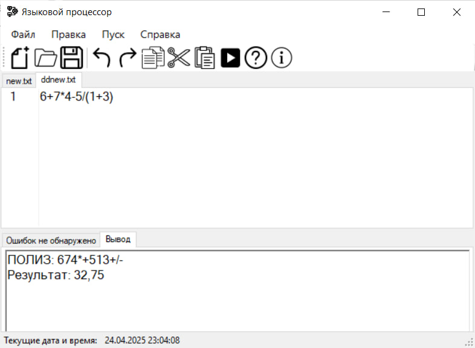
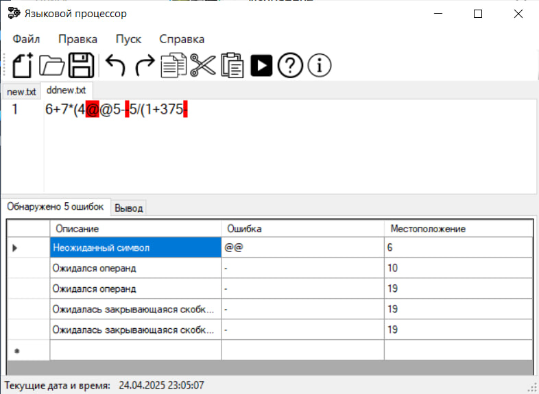
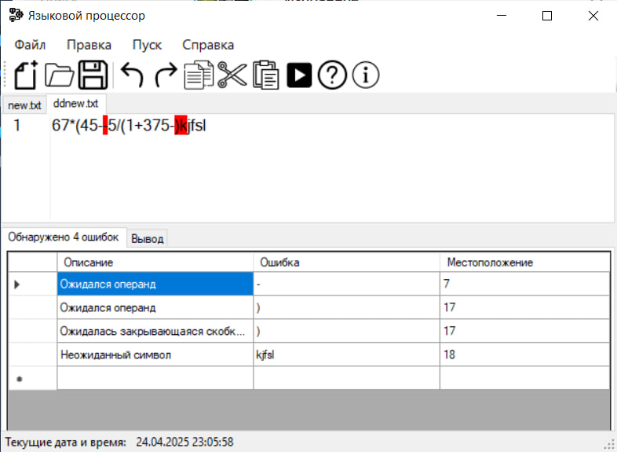

# Постановка задачи

Дополнить анализатор, разработанный в рамках лабораторных работ, этапом формирования внутренней формы представления программы.

## Вариант:

1 вариант. В качестве внутренней формы представления программы выберем польскую инверсную запись (ПОЛИЗ). Эта форма представления наглядна и достаточно проста для последующей интерпретации, которая может быть выполнена с использованием стека.

Задание:

1) Реализовать в текстовом редакторе поиск лексических и синтаксических ошибок для грамматики G[<E>]. Реализовать данную КС-граммматику методом рекурсивного спуска:
```text
1. E → TA 

2. A → ε | + TA | - TA 

3. T → ОВ 

4. В → ε | *ОВ | /ОВ 

5. О → num | (E) 

6. num  → digit {digit}
```
2) Реализовать алгоритм записи арифметических выражений в ПОЛИЗ и алгоритм вычисления выражений в ПОЛИЗ.

## Примеры допустимых строк:

- `6+7+10*4`
- `6+7*4-5/(1+3)`
- `156+45*((256-74)/5)`

## Тестовые примеры





# Справка

## Работа с файлами

### Создание нового файла
Во вкладке **Файл** выберите *Создать* (Ctrl+N).

### Открытие файла
Во вкладке **Файл** выберите *Открыть* (Ctrl+O), либо перетащите файл в окно редактирования.

### Сохранение файла
Во вкладке **Файл** выберите *Сохранить* (Ctrl+S) или *Сохранить как*, чтобы сохранить в другой файл.

### Закрытие файла
Во вкладке **Файл** выберите *Выход* (Ctrl+W), чтобы закрыть открытый файл.

## Работа с текстом (Правка)

- **Отменить/Повторить** - отмена последнего/повтор отмененного действия
- **Вырезать** - выделенный текст вырезается и копируется в буфер обмена
- **Копировать** - выделенный текст копируется в буфер обмена
- **Вставить** - текст из буфера обмена вставляется в окно редактирования
- **Удалить** - удаление выделенного текста
- **Выделить все** - весь текст из окна редактирования выделяется

## Текст

- **Постановка задачи** - сформулированное тема задания
- **Грамматика** - правила грамматики в выбранном языке
- **Классификация грамматики** - информация о классификации грамматики
- **Метод анализа**
- **Диагностика и нейтрализация ошибок**
- **Тестовый пример** - готовый пример для проверки работы языкового процессора
- **Список литературы** - используемые источники для работы
- **Исходный код программы**

## Запуск синтаксического анализатора

Выполняется командой **Пуск**.

## Справка

Содержит **Настройки**, где можно изменить язык интерфейса и размер текста в окне редактирования и вывода результатов.

**Вызов справки** (F1)

**О программе** - контактная информация о программе и ее авторе.

*Приятного использования! Ждем ваших отзывов и предложений.*
