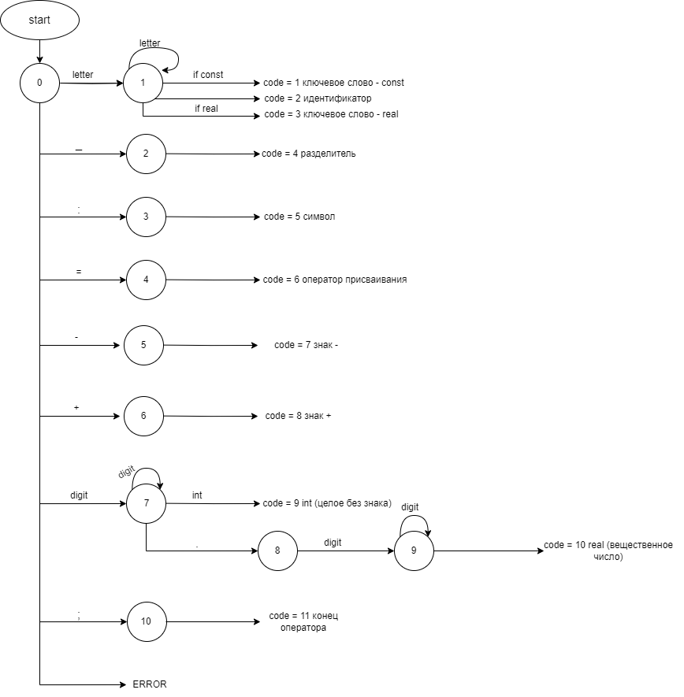
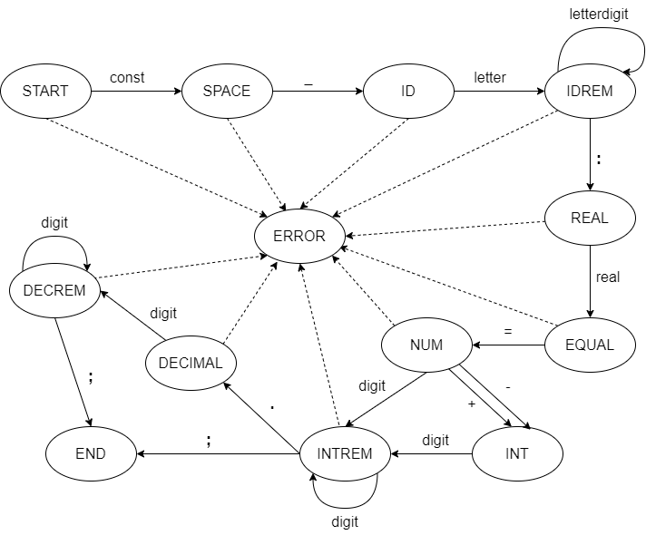
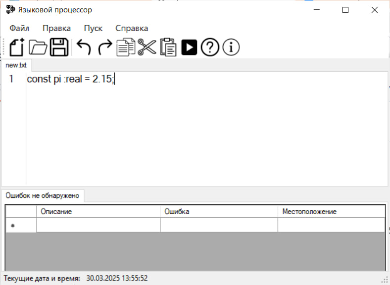
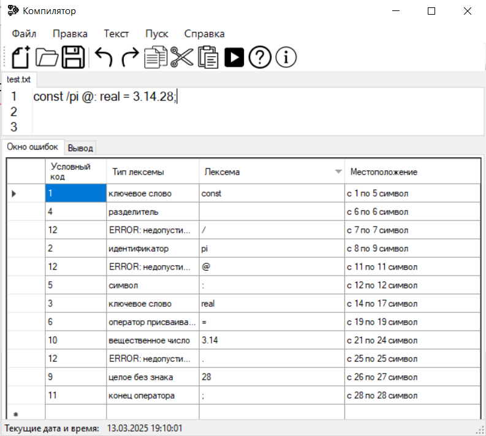
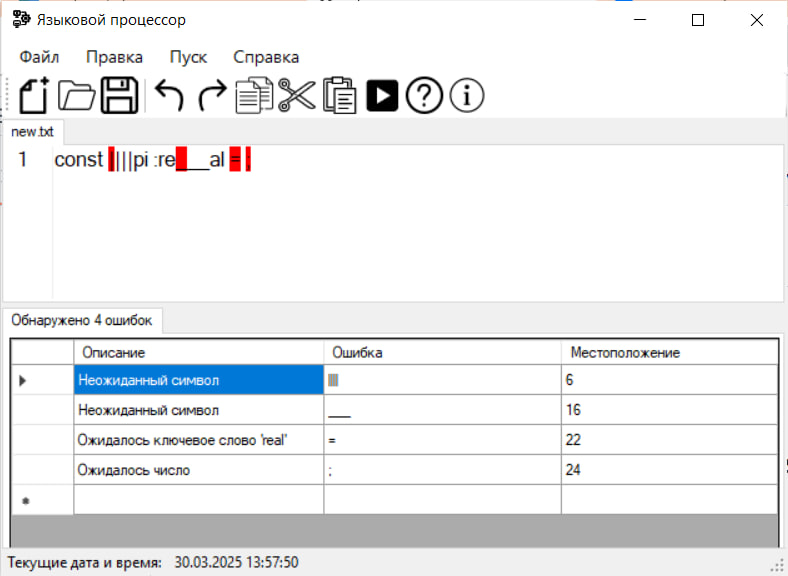
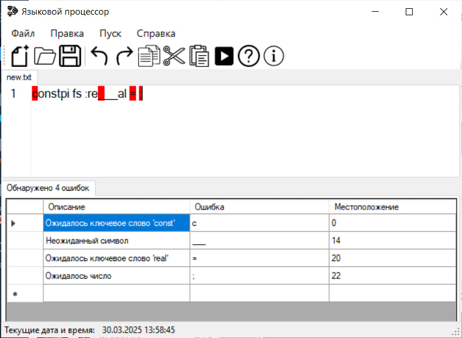
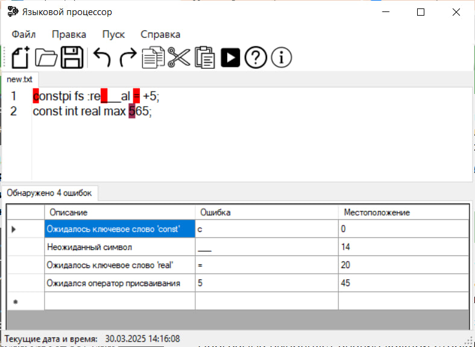

# Постановка задачи

Разработать автоматную грамматику.

Спроектировать граф конечного автомата (перейти от автоматной грамматики к конечному автомату).

Выполнить программную реализацию алгоритма работы конечного автомата.

Встроить разработанную программу в интерфейс текстового редактора, созданного на первой лабораторной работе.

## Вариант:

Объявление вещественной константы с инициализацией на языке Pascal.

## Примеры допустимых строк:

- `const pi: real = 3.14;`
- `const pi: real = +3;`
- `const pi: real = -31.1;`

## Грамматика G[START]

```text
1) <START> -> ‘const’<SPACE>
2) <SPACE> -> ‘ ‘<ID>
3) <ID> -> letter<IDREM>
4) <IDREM> -> letter<IDREM>
5) <IDREM> -> digit<IDREM>
6) <IDREM> -> ‘:’<REAL>
7) <REAL> -> ‘real’<EQUAL>
8) <EQUAL> -> ‘=’<NUM>
9) <NUM> -> ‘+’<INT>
10) <NUM> -> ‘-‘<INT>
11) <NUM> -> digit<INTREM>
12) <INT> -> digit<INTREM>
13) <INTREM> -> digit<INTREM>
14) <INTREM> -> ‘.’<DECIMAL>
15) <DECIMAL> -> digit<DECREM>
16) <DECREM> -> digit<DECREM>
17) <INTREM> -> ‘;’
18) <DECREM> -> ‘;’
Продукции P:
Z = ‹START›;
VT = {a, b, c, ..., z, A, B, C, ..., Z, _,:, =, +, -, ;, ., 0, 1, 2, ..., 9};
VN = {‹START›, ‹SPACE›, ‹ID›, ‹IDREM›, ‹REAL›, ‹EQUAL›, ‹NUM›, ‹INT›, ‹INTREM›, <DECIMAL>, <DECREM>}.
```

## Диаграмма состояний сканера



## Граф конечного автомата



## Тестовые примеры







# Справка

## Работа с файлами

### Создание нового файла
Во вкладке **Файл** выберите *Создать* (Ctrl+N).

### Открытие файла
Во вкладке **Файл** выберите *Открыть* (Ctrl+O), либо перетащите файл в окно редактирования.

### Сохранение файла
Во вкладке **Файл** выберите *Сохранить* (Ctrl+S) или *Сохранить как*, чтобы сохранить в другой файл.

### Закрытие файла
Во вкладке **Файл** выберите *Выход* (Ctrl+W), чтобы закрыть открытый файл.

## Работа с текстом (Правка)

- **Отменить/Повторить** - отмена последнего/повтор отмененного действия
- **Вырезать** - выделенный текст вырезается и копируется в буфер обмена
- **Копировать** - выделенный текст копируется в буфер обмена
- **Вставить** - текст из буфера обмена вставляется в окно редактирования
- **Удалить** - удаление выделенного текста
- **Выделить все** - весь текст из окна редактирования выделяется

## Текст

- **Постановка задачи** - сформулированное тема задания
- **Грамматика** - правила грамматики в выбранном языке
- **Классификация грамматики** - информация о классификации грамматики
- **Метод анализа**
- **Диагностика и нейтрализация ошибок**
- **Тестовый пример** - готовый пример для проверки работы языкового процессора
- **Список литературы** - используемые источники для работы
- **Исходный код программы**

## Запуск синтаксического анализатора

Выполняется командой **Пуск**.

## Справка

Содержит **Настройки**, где можно изменить язык интерфейса и размер текста в окне редактирования и вывода результатов.

**Вызов справки** (F1)

**О программе** - контактная информация о программе и ее авторе.

*Приятного использования! Ждем ваших отзывов и предложений.*
