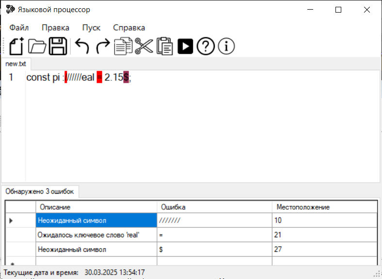

<!DOCTYPE html>
<html>
  <head>
<meta charset="UTF-8">
  </head>
  <body>
	  <h1>Постановка задачи</h1>
    

        Спроектировать диаграмму состояний сканера.
    

    

        Разработать лексический анализатор, позволяющий выделить в тексте лексемы, иные символы считать недопустимыми (выводить ошибку).
    

    

        Встроить сканер в ранее разработанный интерфейс текстового редактора. Учесть, что текст для разбора может состоять из множества строк.
    

    <h2>Вариант:</h2>
    
 Объявление вещественной константы с инициализацией на языке Pascal

    <h2>Примеры допустимых строк:</h2>
	  
	const pi: real = 3.14;
	const pi: real = +3;
	const pi: real = -31.1;

<h2>Диаграмма состояний сканера</h2>

 

<h2>Тестовые примеры</h2>

 

 

    <h1 align=center>Справка</h1>
    
	<h2>Работа с файлами</h2>
	<h3>Создание нового файла</h3>
	
Во вкладке <b>Файл</b> выберите <i>Создать</i> (Ctrl+N)

	<h3>Открытие файла</h3>
	
Во вкладке <b>Файл</b> выберите <i>Открыть</i> (Ctrl+O), либо перетащите файл в окно редактирования 

	<h3>Сохранение файла</h3>
	
Во вкладке <b>Файл</b> выберите <i>Сохранить</i> (Ctrl+S) или <i>Сохранить как</i>, чтобы сохранить в другой файл 

	<h3>Закрытие файла</h3>
	
Во вкладке <b>Файл</b> выберите <i>Выход</i> (Ctrl+W), чтобы закрыть открытый файл

	<h2>Работа с текстом (Правка)</h2>	

<b>Отменить/Повторить</b> - отмена последнего/повтор отмененного действия

<b>Вырезать</b> - выделенный текст вырезается и копируется в буфер обмена

<b>Копировать</b> - выделенный текст копируется в буфер обмена

<b>Вставить</b> - текст из буфера обмена вставляетя в окно редактирования

<b>Удалить</b> - удаление выделенного текста

<b>Выделить все</b> - весь текст из окна редактирования выделяется

<h2>Текст</h2>	

<b>Постановка задачи</b> - сформулированное тема задания

<b>Грамматика</b> - правила грамматики в выбранном языке 

<b>Классификация грамматики</b> - информация о классификации грамматики

<b>Метод анализа</b>

<b>Диагностика и нейтрализация ошибок</b>

<b>Тестовый пример</b> - готовый пример для проверки работы языкового процессора

<b>Список литературы</b> - используемые источники для работы

<b>Исходный код программы</b> 

<h2>Запуск синтаксического анализатора</h2>

Выполняется командой <b>Пуск</b> 

<h2>Справка</h2>

Содержит <b>Настройки</b>, где можно изменить язык интерфейса и размер текста в окне редактирования и вывода результатов

<b>Вызов справки</b> (F1)

<b>О программе</b> - контактная информация о программе и ее авторе

	
<i><b>Приятного использования! Ждем ваших отзывов и предложений.</b></i>

</body>
</html>
